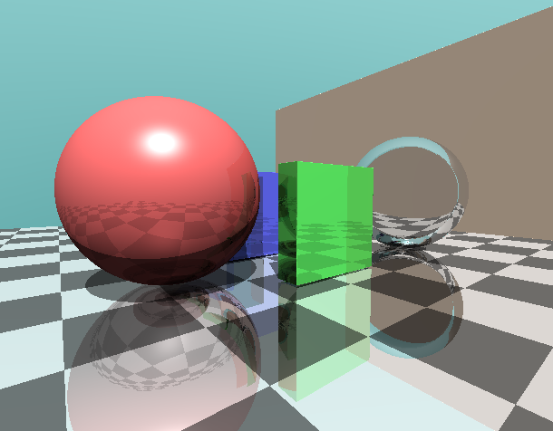

# GLSLによるレイマーチングのデモ


距離関数を利用したレイマーチングを実装し, 陰影, 反射, 屈折などのグラフィック表現や和集合・積集合などによる複雑な図形の表現, フラクタルなどをリアルタイム描画するデモプログラムです.

## 実行方法
```bash
make
sudo ./glsl1 sdfReflection_2_refraction.frag
```

## 操作方法
* WASDで水平移動
* Spaceでジャンプ
* マウスで視点移動
* ESCで一時停止(マウスカーソル解放)
